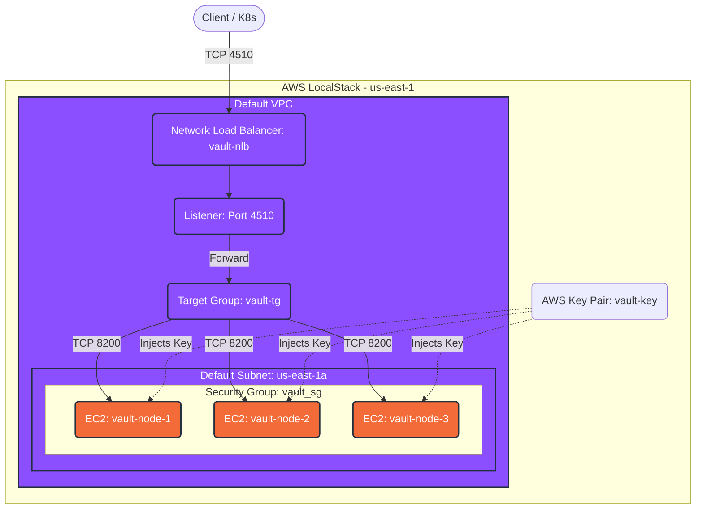

# Architecture Infrastructure

Dưới đây là sơ đồ chi tiết biểu diễn toàn bộ các tài nguyên (resources) được Terraform tạo ra trong LocalStack, bao gồm Mạng lưới (VPC/Subnet), Cân bằng tải (NLB) và các máy chủ (EC2).

## Infrastructure Diagram

## Giải thích chi tiết

- **Mạng lưới cơ bản**: Terraform tạo 1 `aws_default_vpc` và 1 `aws_default_subnet` để gom các tài nguyên lại với nhau.
- **Bảo mật**: `aws_security_group` mở cổng `22` (để Ansible SSH vào cài đặt) và cổng `8200-8201` (cho Vault giao tiếp). `aws_key_pair` được tiêm vào 3 máy EC2 để xác thực SSH.
- **Cân bằng tải (NLB)**: Mọi truy cập từ bên ngoài (như từ Web UI, hay từ K8s Secrets Operator) sẽ gọi vào cổng `4510` của `aws_lb`. Traffic này sẽ đi qua `aws_lb_listener`, được chuyển hướng về `aws_lb_target_group` và cuối cùng được phân phát đều vào cổng `8200` của 3 máy ảo EC2 `aws_instance` thông qua 3 bản ghi `aws_lb_target_group_attachment`.
